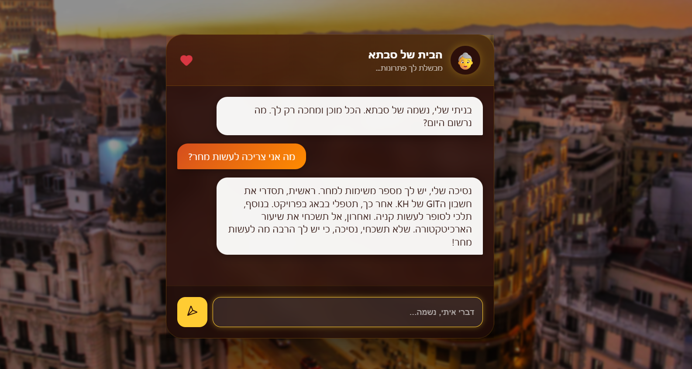

# Project 01: Moroccan Grandma Task Manager

| תיאור הפרויקט |
| :--- |
| פרויקט זה פותח במסגרת קורס AI Agents בהנחיית מלכה ברוק. המערכת מציגה סוכן בינה מלאכותית המנהל משימות עבור המשתמש תוך שימוש בפרסונה ייחודית של סבתא מרוקאית. |

## ארכיטקטורת הסוכן (Models & Logic)

| רכיב | פירוט טכני |
| :--- | :--- |
| **Agent Service** | ה"מוח" של המערכת, המבוסס על מודל שפה גדול. |
| **Persona** | הגדרת אישיות הסבתא באמצעות הנדסת פרומפט (System Prompt) הכוללת חום, דאגה וניואנסים תרבותיים. |
| **NLP Parsing** | יכולת ניתוח טקסט חופשי והמרתו למשימות מובנות הכוללות כותרת ותוכן. |
| **Context Awareness** | שמירה על הקשר השיחה והגבה רלוונטית בהתאם לדחיפות המטלות. |
| **Task Logic** | ניהול רשימת המשימות הכולל כותרת, פירוט וסטטוס ביצוע (New / In Progress / Completed). |

---

## תצוגת מסכי המערכת

| ממשק ניהול משימות ושיחה |
| :---: |
|  |
| **הוספת משימה בשפה טבעית וקבלת תגובה מהסוכן** |

---

## טכנולוגיות בשימוש

| קטגוריה | טכנולוגיה |
| :--- | :--- |
| **Backend** | Python (python-dotenv) |
| **AI Engine** | LLM & Prompt Engineering |
| **Frontend** | React / Node.js |
| **Version Control** | Git & GitHub |

## הוראות הרצה

| שלב | פעולה |
| :--- | :--- |
| **1. Agent** | כניסה לתיקיית Agent, התקנת ספריות והרצת `python main.py`. |
| **2. Config** | העתקת `.env.example` ל-`.env` והזנת מפתח API. |
| **3. Client** | כניסה לתיקיית task-manager-client, הרצת `npm install` ו-`npm start`. |