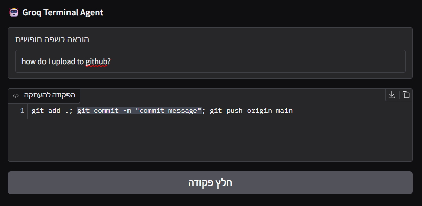

# פרויקט 02: סוכן פקודות טרמינל

### תיאור הפרויקט
פרויקט זה פותח במסגרת קורס סוכני בינה מלאכותית בהנחיית מלכה ברוק. המערכת מציגה סוכן חכם שיודע לקחת בקשות בשפה רגילה ולהפוך אותן לפקודות מחשב מדויקות שמוכנות להעתקה ולהרצה.

---

### ארכיטקטורת הסוכן
* **שירות סוכן:** מבוסס על מודל שפה חזק המופעל דרך ענן מהיר במיוחד.
* **מנוע לוגי:** הגדרת המודל על טמפרטורה אפס כדי להבטיח פלט נקי של פקודות בלבד בלי דיבורים מיותרים.
* **ניהול סביבה:** שימוש בכלי ניהול מודרני המבטיח שהפרויקט ירוץ בצורה מבודדת ותקינה.
* **ניתוח הקשר:** יכולת להבין בקשות מורכבות בנושא קבצים, ניהול גרסאות ובסיסי נתונים.
* **הגדרות:** שמירה מאובטחת של מפתחות הגישה והגדרות המודל בקובץ הגדרות חיצוני.

---

### תצוגת המערכת

**הזנת בקשה חופשית וקבלת פקודה מוכנה להעתקה.**

---

### טכנולוגיות בשימוש
* **צד שרת:** שפת פייתון עם ספריות לניהול סביבה והגדרות.
* **מנוע בינה מלאכותית:** מודל שפה גדול המותאם ליצירת קוד.
* **ממשק משתמש:** מערכת תצוגה מבוססת דפדפן המאפשרת אינטראקציה נוחה.
* **כלי פיתוח:** סביבת עבודה מקצועית וניהול גרסאות.

---

### הוראות הרצה
1. **הגדרות:** עדכון מפתחות הגישה בקובץ ההגדרות.
2. **התקנה:** הרצת פקודת התקנת הספריות בטרמינל.
3. **הרצה:** הפעלת הקובץ הראשי של הפרויקט.
4. **גישה:** פתיחת הכתובת שמתקבלת בדפדפן לצורך שימוש בסוכן.

---

