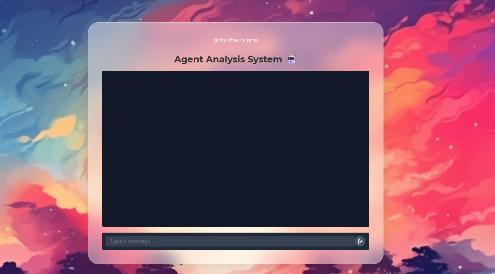

<style>
  body {
    direction: rtl;
  }
</style>

# Agent Analysis System 🤖

קובץ זה מתעד את מערכת ניתוח ה-Agent שחה עבור פרויקט ניהול המשימות. המערכת משלבת יכולות RAG (Retrieval-Augmented Generation) כדי לספק תשובות מדויקות על בסיס תיעוד טכני, לוגים ונתונים מובנים.

**מפתחת הפרויקט:** אילה אלבוגן  
**תאריך עדכון אחרון:** 17 במרץ, 2026

---

## 📌 מה המערכת עושה?
המערכת מאפשרת למפתחים ולמנהלי מוצר לקבל תשובות לשאלות טכניות בזמן אמת, ללא הצורך לחפש בקבצים ובתיעוד באופן ידני. היא משלבת:
- תיעוד סטטי (Markdown, JSON)
- לוגים ו־`extracted_data.json`
- מסדי נתונים וקטוריים (Pinecone)

המטרה: ממשק אחד שמייצר תשובות טבעיות בעברית, מדויקות ומבוססות על העובדות.

---

## 🧠 איך זה עובד? (Workflow)
1. **שליפה מובנית (Structured):** סורק את `extracted_data.json` לאיתור החלטות, חוקים, ונתונים מבניים.
2. **שליפה סמנטית (Semantic):** מחפש הקשרים ועובדות בבסיס וקטורי (Pinecone).
3. **אימות ביטחון (Confidence Check):** בודק שהמידע שמצא אכן מתאים לשאלה ומספק אותו רק אם יש עליו תמיכה.
4. **סינתזה:** מחבר תשובה טבעית בעברית מהמידע שאושר.

> **[כאן יש להוסיף צילום מסך של תרשים ה‑Workflow מתוך `workflow_graph.html`]**

---

## 🚀 התקנה והרצה

### 1. התקנת תלויות
```bash
pip install llama-index llama-index-llms-groq llama-index-embeddings-cohere llama-index-vector-stores-pinecone pinecone-client gradio python-dotenv
```

### 2. הגדרת משתני סביבת עבודה (`.env`)
בתיקיית השורש של הפרויקט, צרו קובץ `.env` עם המפתחות הבאים:
```text
GROQ_API_KEY=your_key_here
COHERE_API_KEY=your_key_here
PINECONE_API_KEY=your_key_here
```

### 3. הפעלה
* `python main.py` — מריץ את ממשק ה‑Gradio (צ'אט בדפדפן).
* `python run_pipeline.py` — מסרק קבצי Markdown ומעדכן את האינדקס ב‑Pinecone.

> ****

---

## 💬 דוגמאות לשאלות ותשובות (QA)

<div dir="rtl">

| מקור המידע | תמצית תשובה | שאלה |
| :--- | :--- | :--- |
| `main.py` | אילה אלבוגן (המייל אינו מופיע בתיעוד). | מי המפתח ומה המייל שלו? |
| `UI_SPEC_VISION.md` | שימוש ב‑backdrop‑filter להפרדת תוכן מהרקע. | מה הקשר בין 'Cozy‑Digital' ל‑Blur? |
| `extractor.py` / לוג | המתנה (Backoff) וניסיון חוזר מול Groq. | איך המערכת מטפלת בשגיאות 429? |
| `extracted_data.json` | בחירת גישת Polling על פני WebSockets. | אילו החלטות טכניות התקבלו ב‑11 במרץ? |

</div>

> ****
