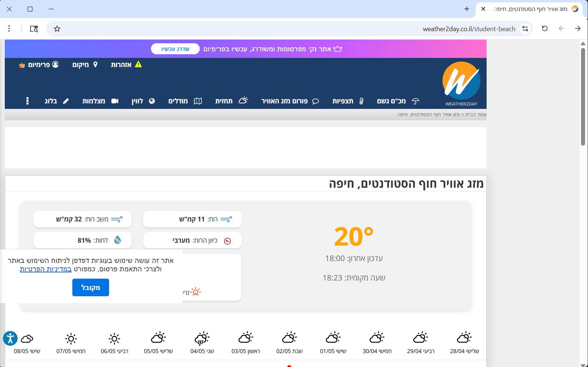

# 🌍 MCP Weather Agent — Israel & USA

מיקרו־פרויקט המדגים סוכן מבוסס Model Context Protocol (MCP) לאיסוף ותגובה על נתונים בזמן אמת ממקורות מזג אוויר בישראל ובארה"ב.

**מחבר:** אילה אלבוגן
**עודכן:** 2026-08-16

---

## מה זה?
`MCP Weather Agent` הוא סוכן אסינכרוני בכתבי־Python שמשלב:
- איסוף דינמי של מזג אוויר באמצעות Playwright (automation/browser scraping)
- תקשורת דרך פרוטוקול MCP בין `host` ל־`client`
- שימוש במודלים חיצוניים (Groq / Anthropic) לעיבוד בקשות והשבת תשובות

הפרויקט כולל דוגמאות להרצה מקומית ושיקוף לוגים ותמונות מתוך הריצה ב־`assets/`.

---

## מה במאגר
- `host.py` — רכיב ה־Host שמשגר בקשות וסונכרן עם הלקוח.
- `client.py` — דוגמת לקוח MCP שמקבל משימות ועושה Scraping עם Playwright.
- `weather_Israel.py` / `weather_USA.py` — סקריפטים לדוגמא לאיסוף נתונים ספציפיים לאתרים.
- `assets/` — תמונות וסקרינשוטים מתוך הרצה (כולל `air.png`).
- `pyproject.toml` — הגדרות והתקנות (אם קיימות).

---

## התקנה (מהיר)
1. צרו סביבת עבודה וירטואלית (מומלץ):

```powershell
python -m venv .venv
.\.venv\Scripts\Activate.ps1
```

2. התקינו תלויות:

```powershell
pip install -r requirements.txt
```

3. העתקו/צרו קובץ `.env` בתיקיית הפרויקט והוסיפו מפתחות רלוונטיים:

```text
ANTHROPIC_API_KEY=...
GROQ_API_KEY=...
```

---

## הרצה
- להפעיל את הסקריפט הישראלי (Playwright יפעיל דפדפן):

```powershell
python weather_Israel.py
```

- להפעיל את הסקריפט לארה"ב:

```powershell
python weather_USA.py
```

- להפעיל את ה־Host:

```powershell
python host.py
```

הערה: אם אתם משתמשים ב־Playwright בפעם הראשונה, הריצו `playwright install` כדי להתקין דפדפנים.

---

## דמו ותמונות
צילום מסך מה־`assets/air.png` מציג את הדפדפן בזמן הסריקה:



---

## דוגמאות שימוש
- "מה מזג האוויר בחיפה עכשיו?"
- "האם יש התראות מזג אוויר בניו יורק?"
- "האם כדאי לקחת מטריה מחר לירושלים?"

---

## טכנולוגיות וכלים
- Python 3.11+
- Asyncio
- Playwright
- Model Context Protocol (MCP)
- Groq / Anthropic APIs

---